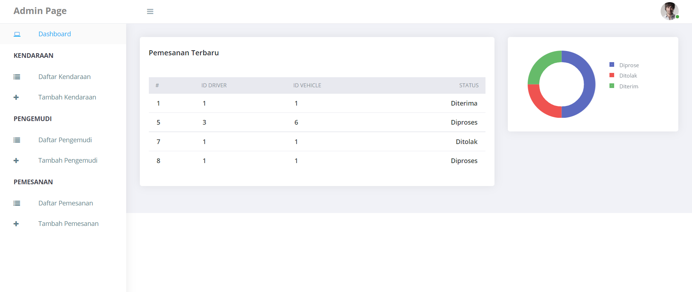

# julio-betta-fish-backend

Pemesanan Kendaraan using laravel

# Clone Repository

`git clone https://github.com/dprastha/Pemesanan-Kendaraan-App.git`

# Import Database

## Import database to phpmyadmin on folder importDB/pemesanan-kendaraan.sql

Pastikan nama database sama dengan nama file .sql

# Setting project

## .env

jika tidak ada file `.env`, buat sendiri lalu copy dari file `.env.example`

# Running Development

`php artisan serve`

# Login akun

## Admin

email : `admin@gmail.com`
password : `123456`

## Penyetuju

email : `penyetuju@gmail.com`
password : `123456`
